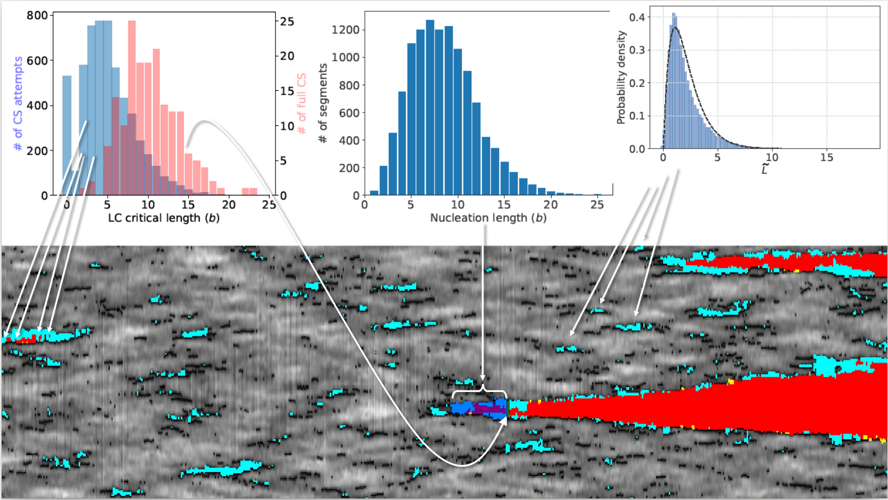

# Cross-slipping dislocations
This repo contains the core parts of my cross-slipping dislocations research. Auxilray parts, including data across the pipline, remain hosted elsewhere.

## Research calculations workflow
1. Design atom scale simulations
2. Execute parallel computations
3. Parse and transform resulting xyz coordinates data into graph data using OVITO
4. Extract via OVITO's API the dislocations analysis data into numpy *.npy data files
5. Analyse and visualize

## Example of a processed simulation and a few statistical analyses of it